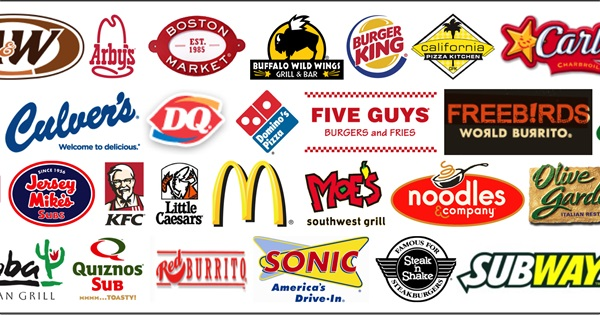

# US Fast Food Restaurants

## INTRODUCTION
The fast food industry in the United States is worth approximatly __198.9 billion U.S. dollers__ . By 2020,this figure is forecasted to exceed __223 billion__.The majority of this large market is comprised of on-premises restaurants and drive-thrus, the rest consists of off-premises dining (take out) and cafeterias and buffets. 
In 2016, there were __186,977 franchised__ quick service restaurants in the United States; a figure which has grown by almost 28 thousand from almost a decade ago.

## DATA

  | Column Name | Description |
  | --- | --- |
  | address | Address of the restaurant |
  | city | City name in which the restaurants resides |
  | country | Name of the country |
  | keys | key consists of country,province,city and address and random number |
  | latitude | latitude of the restaurants |
   | longitude | longitude of the restaurants |
   | name | name of the restaurants |
   | postalcode | postalcode of the restaurants |
   | province | state of the restaurants | 
   | websites | website of the restaurants |

## PROJECT ANALYSIS
| Description | Analysis |
| --- | --- |
| Restaurant_Data | 
